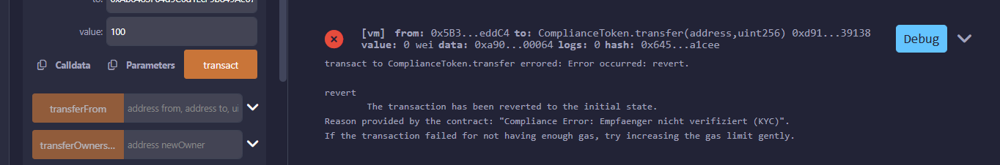

# Compliance-Token-Smart-Contract

An ERC-20 token implementation featuring an integrated KYC/Compliance whitelist to ensure regulated asset transfers.

## 🎯 Project Overview
This project demonstrates a regulatory-compliant smart contract solution. It features a custom **Compliance Gate** that restricts token transfers to verified addresses only. 

By implementing this logic at the protocol level, the asset ensures that all participants meet specific verification standards before they can receive tokens.

## 🛠 Tech Stack
* **Language:** Solidity ^0.8.20
* **Standards:** OpenZeppelin ERC-20
* **IDE:** Remix (VM Osaka)
* **Framework:** OpenZeppelin Ownable (for secure administrative control)

## 🧪 Proof of Concept (Security Test)
The core logic of this contract is to protect the asset by blocking unauthorized transactions. I have performed a stress test to verify that the security gate works as intended.

### Test Case: Unauthorized Transfer (Rejected)
As shown in the screenshot below, the transaction is automatically reverted by the blockchain because the recipient is not yet KYC-verified.

*> Note: The screenshot shows the error message in German as defined in the source code: "Empfaenger nicht verifiziert"*

* **Result:** The contract successfully triggered the error message: 
  > **"Compliance Error: Recipient not verified (KYC)"**

---

## 🚀 Key Learning Outcomes
* Implementing **Access Control** in Smart Contracts.
* Customizing the **ERC-20 `_update` function** to include conditional logic.
* Testing and debugging in a **Blockchain Sandbox environment** (Remix VM).
